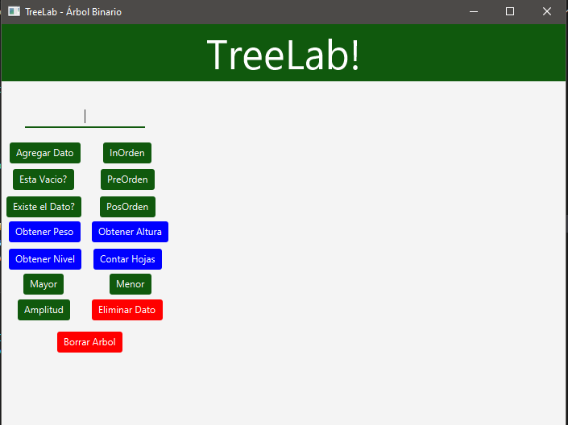
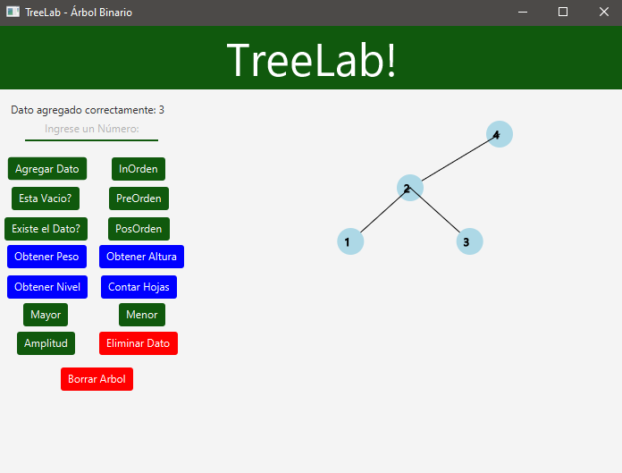

# TreeLab - Binary Tree Visualization

## Overview
TreeLab is a Java application that visualizes the structure and manipulation of a binary tree. The project allows users to add data dynamically, visualize the tree, and perform operations such as inserting nodes into the binary tree. The application uses JavaFX for the graphical user interface (GUI) and canvas for rendering the tree structure.



## Features
- **Add Data**: Users can input integer values which will be inserted into the binary tree.
- **Visual Representation**: The binary tree is visualized on a canvas, with nodes and connections drawn dynamically.
- **Error Handling**: If the user inputs invalid data, an error message is displayed.

## Requirements
- JDK 17 or higher
- JavaFX 22 or compatible version
- Maven (for building the project, if necessary)

## Setup
1. Clone the repository to your local machine:
- Press ctrl + ñ to open console, then copy and paste:
```bash
   git clone https://github.com/estebangmz666/TreeLab.git
   ```
2. Build the project:
- If you're using Maven, navigate to the project directory and run:
  ```
  mvn clean install
  ```
3. Open the project in your preferred IDE (e.g., IntelliJ IDEA, Eclipse) and make sure JavaFX is configured correctly.
4. Run the project by executing the `App.java` file.

## Usage
1. Launch the application.
2. The GUI will appear with an input field for entering integer values.
3. Enter an integer value and click the "Add" button to insert it into the binary tree.
4. The tree will be drawn on the canvas, displaying the newly inserted node.
5. Invalid inputs will trigger an error message on the UI.



## Code Structure
- `App.java`: The main entry point of the application, which launches the JavaFX UI.
- `TreeController.java`: Handles the interaction with the UI, including event handling and tree visualization.
- `TreeNode.java`: Represents a node in the binary tree.
- `Tree.java`: Manages the binary tree operations like insertion.

### License
This project is licensed under the **GNU/GPL** License. See the [GNU/GPL License](https://www.gnu.org/licenses/gpl-3.0.html) for more details.
